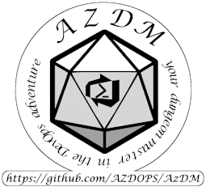

# AzDM - Azure DevOps Manager



This is the home of the Azure DevOps manager, or the Dungeon Master if you will.

For code, modules, and templates, pleas visit the [AzDM template repo](https://github.com/AZDOPS/AzDMTemplate)

## Downloads and versions

To get the latest _published_ release, go get [the documentation](https://github.com/AZDOPS/AzDM/releases) and  [the related template](https://github.com/AZDOPS/AzDMTemplate/releases). Version numbers here is released synchronously and contain the correct docs for this specific release.

If you feel brave you can run anything from the repos directly, and main _should_ work, but updates here may be done at any time and the feature set may change from day to day. You can find which version you are running by looking in the module [PSM1 file](https://github.com/AZDOPS/AzDMTemplate/blob/main/.module/AzDM.psm1), first line. vNext implies _this was created after the version stated, but before the next version number release_. Consider vNext to be a "nightly" style build.

## What is AzDM?

AzDM is an [opinionated](https://stackoverflow.com/questions/802050/what-is-opinionated-software) project to manage Azure DevOps as code. It is _highly_ inspired by the [AzOps](https://github.com/Azure/AzOps) project, and stems from the idea that **_everything in Azure DevOps is a resource, and can be viewed and managed as a folder or file configuration_**

This is not to be considered a "one click solution", but a base for you to build on. You may need to implement extra settings, or add your own configurations.

The core functionality comes from the [AzDM module](./documentation/module.md) written in PowerShell, and the related [pipelines](https://github.com/AZDOPS/AzDMTemplate/tree/main/.pipelines)

## Getting started

For tutorials, please see [the setup documentation](./documentation/Setup/requirements.md), the [functionality documentation](./documentation/readme.md), or check out [the setup accelerator scripts](./setupAccelerator/readme.md).

Documentation and examples are currently being worked on and functionality will be updated and / or added in time. You can find some helper functions already in the [helperFunction folder](./helperFunctions/readme.md)

## Folder structure

The managed Azure DevOps organization is set up with folders representing Azure DevOps projects and tries to emulate the GUI layout of Azure DevOps - `Overview`, `boards`, `repos`, `pipelines`, `test Plans`, `Artifacts` - Although most of the functionality is still a work in progress.

```text
📂\Root
    💿config.json
     └─ 📂\Discworld
         └─ 💿Discworld.json
            📂\pipelines
             └─ 💿Discworld.pipelines.json
            📂\repos
             └─ 💿Discworld.repos.json
        📂\MiddleEarth
         └─ 💿MiddleEarth.json
            📂\pipelines
             └─ 💿MiddleEarth.pipelines.json
            📂\repos
             └─ 💿MiddleEarth.repos.json
        📂\Westeros
         └─ 💿Westeros.json
            📂\pipelines
             └─ 💿Westeros.pipelines.json
                📂kingsLanding
                 └─ 💿kingsLanding.json
                📂\Meereen
                 └─ 💿Meereen.json
            📂\repos
             └─ 💿Westeros.repos.json
                📂\kingsLanding
                 └─ 💿\kingsLanding.json
```

## Todo

Current plans for future functionality may be found in [the todo list](./todo.md). Feel free to [create an issue](https://github.com/AZDOPS/AzDM/issues) of you have any requests.

## Contributing

This project happily accepts contributions of all kinds.

- Add functionality
- Add documentation
- Request functionality
- Report bugs

All help is good help.

However, we kindly do request you follow [our code of conduct](code_of_conduct.md)
